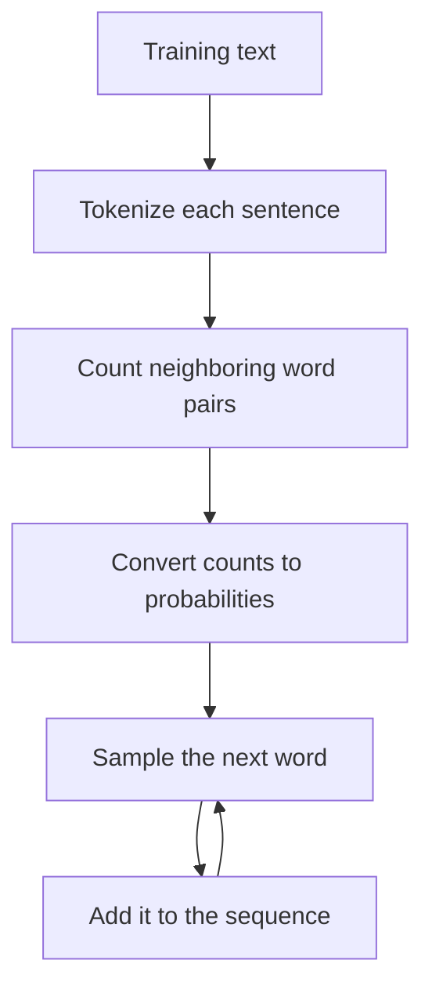

# Tiny Language Model from Scratch

**Concept 01** of my **Scratch the Fundamentals** series.

This project explores one of the core ideas behind language models:

> Given the current context, what is likely to come next?

It is **not a Transformer or a modern Large Language Model (LLM)**. It is a small statistical model that learns which words commonly follow one another, converts those observations into probabilities, and generates new text through weighted sampling.

## What This Project Covers

- Tokenization
- Vocabulary creation
- Word-pair counting
- Conditional probability
- Weighted random sampling
- Autoregressive text generation
- The difference between a bigram model and a modern LLM

## How It Works

Given this training text:

```text
i like python
i like ml
i like ai
```

the model learns:

```text
i    → like
like → python, ml, ai
```

Each candidate appears once after `like`, so each has the same probability:

```text
P(python | like) = 1/3 = 0.33
P(ml     | like) = 1/3 = 0.33
P(ai     | like) = 1/3 = 0.33
```

The model repeatedly samples a next word from these learned probabilities and adds it to the generated sequence.



## Project Code

```python
from collections import Counter, defaultdict
import random


# A tiny training dataset. Each line is treated as a separate sentence.
corpus = """
i like python
i like ML
i like AI
python is easy
python is powerful
ML is interesting
AI is powerful
"""

sentences = [line.lower().split() for line in corpus.strip().splitlines()]
tokens = [word for sentence in sentences for word in sentence]

print("Tokens:")
print(tokens)

vocabulary = sorted(set(tokens))

print("\nVocabulary:")
print(vocabulary)
print("\nVocabulary size:", len(vocabulary))

# Store how often each word follows another word.
next_word_counts = defaultdict(Counter)

for sentence in sentences:
    for current_word, next_word in zip(sentence, sentence[1:]):
        next_word_counts[current_word][next_word] += 1

print("\nWhat the model learned:")

for current_word, possible_words in next_word_counts.items():
    print(current_word, "->", dict(possible_words))

# Convert the counts after one example word into probabilities.
word = "like"
possible_words = next_word_counts[word]
total = sum(possible_words.values())

print(f"\nPossible words after '{word}':")

for candidate, count in possible_words.items():
    probability = count / total
    print(candidate, "count:", count, "probability:", round(probability, 2))

# A fixed seed makes the demonstration reproducible.
random.seed(10)
generated_words = ["i"]

for _ in range(10):
    current_word = generated_words[-1]

    if current_word not in next_word_counts:
        break

    possible_words = list(next_word_counts[current_word].keys())
    frequencies = list(next_word_counts[current_word].values())

    selected_word = random.choices(
        possible_words,
        weights=frequencies,
        k=1,
    )[0]

    generated_words.append(selected_word)

generated_sentence = " ".join(generated_words)

print("\nGenerated text:")
print(generated_sentence)
```

## Step-by-Step Explanation

### 1. Prepare the Training Data

The corpus contains seven short sentences. A real LLM is trained on an enormous collection of text, but this tiny dataset makes the underlying idea easy to inspect.

Each line is processed separately so the model does not create false pairs between two different sentences.

### 2. Tokenize the Text

```python
sentences = [line.lower().split() for line in corpus.strip().splitlines()]
```

This code:

1. separates the corpus into lines,
2. converts every line to lowercase, and
3. splits each sentence into words.

For example:

```text
"I like Python" → ["i", "like", "python"]
```

This project uses a simple word-level tokenizer. Modern LLMs normally use **subword tokenization**, meaning a token may represent a complete word, part of a word, punctuation, or another text fragment.

### 3. Build the Vocabulary

```python
vocabulary = sorted(set(tokens))
```

`set(tokens)` removes duplicates, and `sorted(...)` arranges the unique words alphabetically.

```text
['ai', 'easy', 'i', 'interesting', 'is', 'like', 'ml', 'powerful', 'python']
```

The vocabulary size is **9**.

### 4. Learn Word Relationships

```python
next_word_counts = defaultdict(Counter)
```

This structure stores a frequency table:

```text
current word → possible next words and their counts
```

The nested loop examines every neighboring pair within each sentence:

```python
for sentence in sentences:
    for current_word, next_word in zip(sentence, sentence[1:]):
        next_word_counts[current_word][next_word] += 1
```

The learned relationships include:

```text
i      -> {'like': 3}
like   -> {'python': 1, 'ml': 1, 'ai': 1}
python -> {'is': 2}
ml     -> {'is': 1}
ai     -> {'is': 1}
is     -> {'easy': 1, 'powerful': 2, 'interesting': 1}
```

This is called a **bigram model** because it learns from pairs of consecutive words.

### 5. Convert Counts into Probabilities

For the word `like`, the model observed:

| Next word | Count | Probability |
| --- | ---: | ---: |
| `python` | 1 | 0.33 |
| `ml` | 1 | 0.33 |
| `ai` | 1 | 0.33 |

The conditional probability is:

```text
P(next word | current word) = pair count / total outgoing count
```

### 6. Sample the Next Word

```python
selected_word = random.choices(
    possible_words,
    weights=frequencies,
    k=1,
)[0]
```

The model chooses randomly, but words seen more often receive a higher chance of selection.

For example:

```text
is -> {'easy': 1, 'powerful': 2, 'interesting': 1}
```

Therefore, `powerful` is twice as likely to be selected as `easy` or `interesting`.

### 7. Generate Text

Generation begins with:

```python
generated_words = ["i"]
```

The program then:

1. reads the current word,
2. finds its possible next words,
3. samples one using the learned frequencies,
4. adds it to the sequence, and
5. uses the selected word as the new context.

This is a basic form of **autoregressive generation**: each new prediction becomes part of the input used for the next prediction.

Generation stops when the requested length is reached or the current word has no known continuation.

## Why Use `random.seed(10)`?

Sampling can produce different results on every run. Setting a seed makes the choices reproducible, which is useful for learning, demonstrations, and testing.

Remove or change the seed to explore different outputs.

## Is This Really an LLM?

No. This project is a **word-level bigram statistical language model**.

It demonstrates next-word prediction, probability, sampling, and repeated generation, but it does not understand meaning or track long-range context. It has no embeddings, neural network, attention mechanism, or learned neural parameters.

| Tiny bigram model | Modern LLM |
| --- | --- |
| Uses word-level tokens | Usually uses subword tokens |
| Counts neighboring word pairs | Learns neural-network parameters |
| Considers one previous word | Uses a large context window |
| Stores a probability table | Uses a Transformer architecture |
| Trains on a tiny corpus | Trains on massive datasets |
| Has no embeddings | Learns high-dimensional embeddings |
| Has no attention | Uses multi-head self-attention |

The shared high-level idea is:

> Use the available context to estimate a probability distribution for what comes next.

## Run the Project

### Requirements

- Python 3.8 or later
- No third-party packages

### Installation

```bash
git clone <https://github.com/istin-dev/tiny-language-model-from-scratch.git>
python first_language_model.py
```

On some systems, use `python3` instead of `python`.

## Project Structure

```text
tiny-language-model-from-scratch/
├── first_language_model.py
└── README.md
```

## Limitations

- It remembers only one previous word.
- It cannot represent meaning or semantic similarity.
- It cannot generate words outside its vocabulary.
- Its output depends completely on the small training corpus.
- It has no explicit beginning-of-sentence or end-of-sentence tokens.
- It may produce repetitive or grammatically incomplete text.

These limitations motivate the next steps toward n-gram models, embeddings, neural networks, attention, and Transformers.

## Learning Resources

- [OpenAI Tokenizer](https://platform.openai.com/tokenizer) — explore how text is divided into tokens.
- [Transformer Explainer](https://poloclub.github.io/transformer-explainer/) — explore tokenization, embeddings, attention, probabilities, temperature, top-k, and top-p.
- [The Illustrated Transformer](https://jalammar.github.io/illustrated-transformer/) — develop a visual understanding of the Transformer architecture.

## What I Learned

Building this project helped me understand that language generation is not simply a lookup process:

```text
Question → stored answer
```

Instead, a language model estimates what is likely to come next based on context. This tiny model does that with frequency counts; modern LLMs do it with learned representations and Transformer neural networks at a vastly larger scale.


## Author

**Istin B**

Learning AI from first principles by building practical projects and documenting the journey.

- [GitHub](https://github.com/istin-dev)
- [LinkedIn](https://www.linkedin.com/in/istin-b-4210b9299/)
